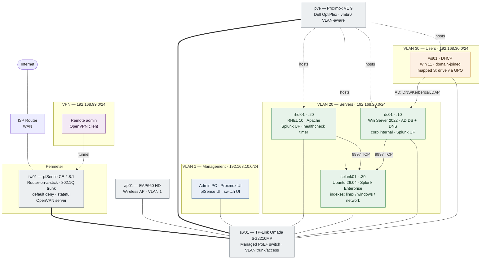

# Network Architecture — Enterprise Infrastructure Operations Lab

> Paste this block into `architecture/network-diagram.md`. GitHub renders Mermaid natively.

## Traffic policy summary (enforced on pfSense)

| Source | Allowed to | Purpose |
|---|---|---|
| VLAN 1 (Mgmt) | all VLANs | administration |
| VLAN 20 (Servers) | internet, each other | updates, log forwarding |
| VLAN 30 (Users) | dc01 (AD ports only), internet | domain services, browsing |
| VLAN 30 (Users) | rest of VLAN 20 | **blocked** (default deny) |
| VPN (99) | rhel01/splunk01 admin ports | remote administration |

Default posture is **deny**; every allow is an explicit, scoped rule.