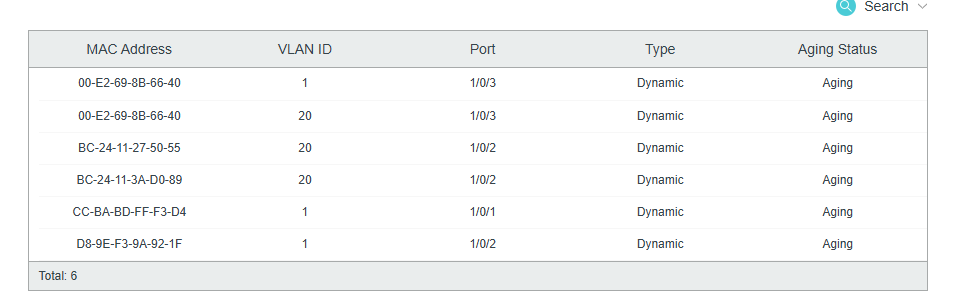
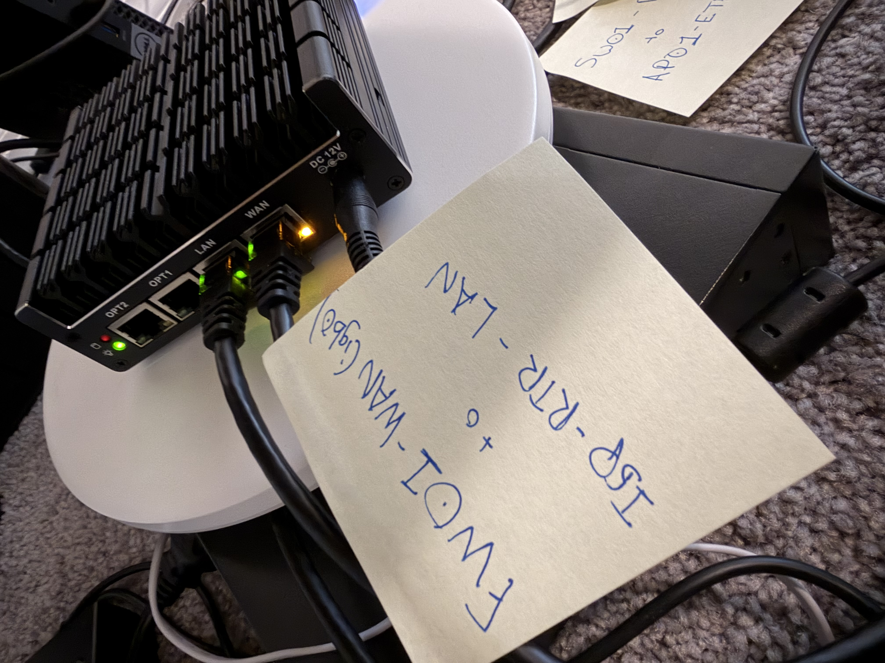
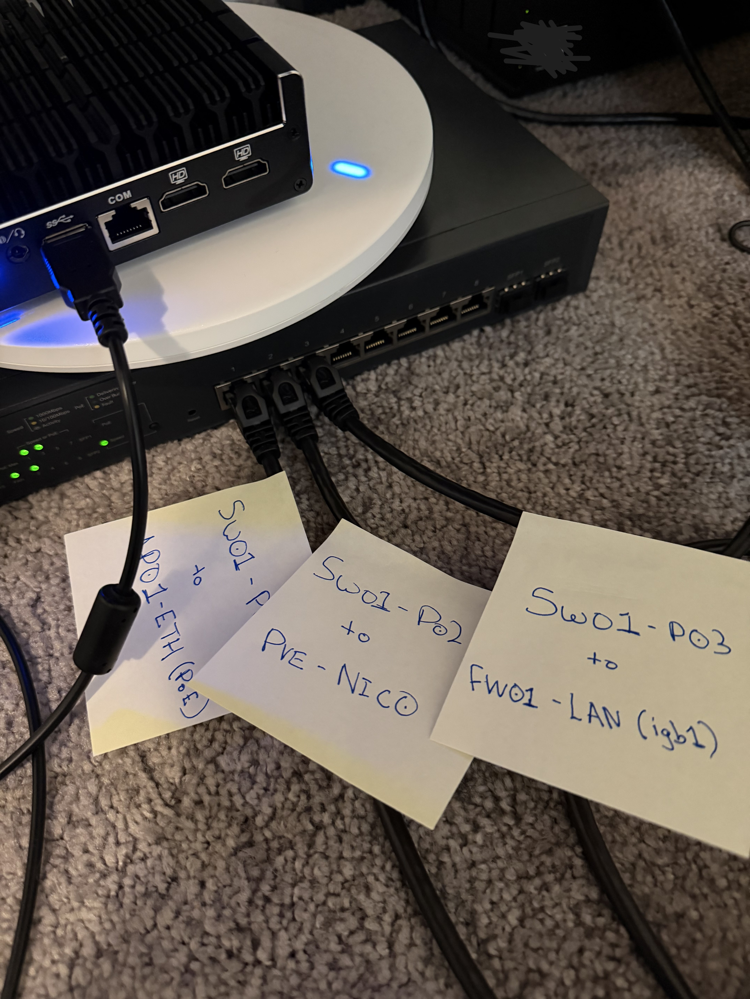

# RH-0001: Remote Hands — Cable/Asset Verification and AP Port Move

| Field | Value |
|---|---|
| Requested by | NOC |
| Performed by | Corey Armstrong (on-site) |
| Date | 2026-10-02 |
| Status | Complete — port move rolled back as planned |

## 1. Asset verification
| Device | Hostname (configured) | Model | Serial | Match |
|---|---|---|---|---|
 Accounted for all devices and they all match correct mac addresses and serial #'s which are kept in private folder.

## 2. Interface / port verification (switch MAC address table)

| Switch port | MAC learned | VLAN | Device | Link | Expected | Result |
|---|---|---|---|---|---|---|
| P01 | CC:BA:BD:FF:F3:D4 | 1 | ap01 | Up | ap01 | ✅ |
| P02 | D8:9E:F3:9A:92:1F | 1 | pve (nic0) | Up | pve + VMs | ✅ |
| P02 | BC:24:11:27:50:55 | 20 | rhel01 (VM) | Up | pve + VMs | ✅ |
| P02 | BC:24:11:3A:D0:89 | 20 | splunk01 (VM) | Up | pve + VMs | ✅ |
| P03 | 00:E2:69:8B:66:40 | 1 | fw01 LAN (igb1) | Up | fw01 LAN trunk | ✅ |
| P03 | 00:E2:69:8B:66:40 | 20 | fw01 SERVERS (igb1.20) | Up | fw01 LAN trunk | ✅ |

**Interpretation:**
- fw01's MAC on VLANs 1 and 20 on P03 confirms the trunk (VLAN subinterfaces share the parent MAC).
- P02 carries the Proxmox host (VLAN 1) and both VMs (VLAN 20) over one cable, confirming the VLAN-aware bridge.
- MAC prefixes identify device type: `BC:24:11` = Proxmox virtual NIC; `D8:9E:F3` = Dell (OptiPlex).
- No VLAN 30 entries: no active Users devices at time of check (expected).

## 3. Cable labels applied

## 4. Equipment layout
See [Equipment Layout](../architecture/equipment-layout.md).

## 5. Port move: ap01 sw01-P01 → sw01-P05

**Purpose:** Validate a cable move procedure, including requirement checks and rollback.
**Requirement:** ap01's switch port must carry VLAN 1 (untagged, management) **and** VLAN 30 (tagged, Users Wi-Fi).

| Step | Time | Action | Result |
|---|---|---|---|
| Pre-check 1 | ~2:55 PM | `ping -t 192.168.10.3` | Replies, ~2 ms |
| Pre-check 2 | ~2:55 PM | VLAN Config: VLAN 30 members | 1/0/1-3. Port 5 not a member |
| Move | ~2:56 PM | Cable moved P01 → P05 | AP lost PoE power and rebooted; ping timed out |
| Post-check 1 | ~2:57 PM | Ping | Replies resumed: management reachable on VLAN 1 (untagged on P05) |
| Post-check 2 | ~2:57 PM | VLAN 30 membership | **FAIL**: still 1/0/1-3; P05 not tagged for VLAN 30, so AP cannot carry Users traffic |
| Decision | ~2:57 PM | Requirement not met | Rollback initiated |
| Rollback | ~2:58 PM | Cable returned P05 → P01 | AP rebooted; ping timed out |
| Post-rollback | 2:59 | Ping + VLAN 30 membership on P01 | Replies resumed; P01 tagged for VLAN 30. **Restored** |

*Times approximate: the continuous ping did not record timestamps. Future changes will use a timestamped ping for exact downtime.*

**Outcome:** Rolled back as planned. ap01 restored on P01 with correct VLAN membership.

**Lesson:** A successful ping showed the AP was *reachable*, not that it was *correct*. Checking the port against its actual requirement (VLAN 30 membership) caught the problem. Before moving a cable, confirm the destination port's VLAN configuration matches the source port.

## Findings
- Move equipment to a shelf or rack off the floor; separate stacked devices for airflow; apply permanent labels." Spotting airflow, ESD, and labeling problems is a core part of Project 3, so you're already gathering material for it.